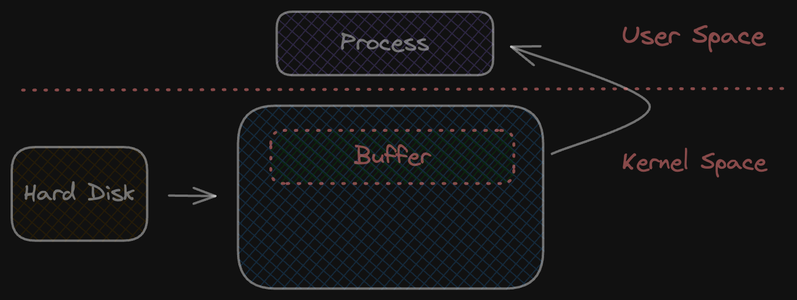
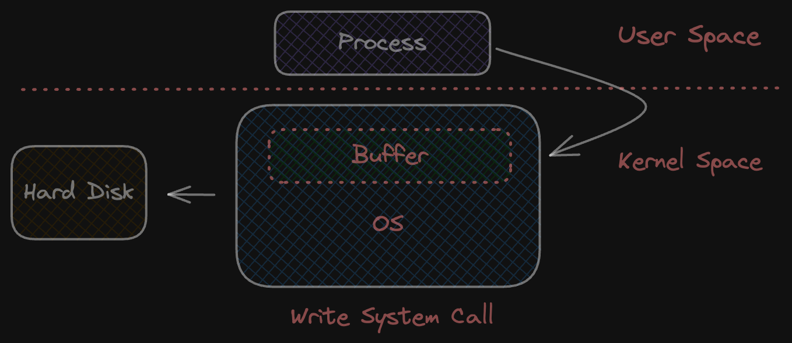
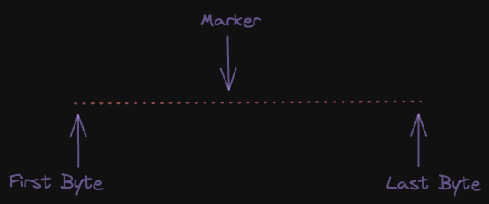
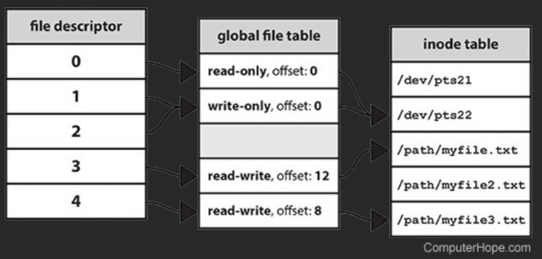

System calls, as the name suggests, are requests made by a user program to the operating system to perform 
certain tasks on behalf of the program. They resemble regular function calls initiated by the user program. 
Whether it's writing to or reading from a file, making network calls, or other operations, system calls 
work behind the scenes to facilitate these actions. Today, we'll delve into the read and write system calls 
and explore the intricacies surrounding them.

### Read System Call

Golang provides more abstracted `os` package to do file operation. But you can directly use `syscall` package
if needed.

```go
func main() {
    fd, err := syscall.Open("example.txt", syscall.O_RDONLY, 0)
    if err != nil {
        fmt.Println("Error opening file:", err)
        return
    }
    defer syscall.Close(fd)

    buffer := make([]byte, 1024) // buffer to store read data
    bytesRead, err := syscall.Read(fd, buffer)
    if err != nil {
        fmt.Println("Error reading file:", err)
        return
    }
    fmt.Printf("Read %d bytes from file:\n%s", bytesRead, string(buffer[:bytesRead]))
}
```

Above code opens a file using `syscall.Open` call which returns a file descriptor. Kernel checks if requested data is present in 
buffer cache, if data is present it copies the data into user buffer. Otherwise, kernel makes a disk read to fetch the data and store it
in buffer. Common pattern is to read more than what is required so next time `read syscall` will result in cache hit.




### Write System Call


```go
func main() {
    fd, err := syscall.Open("example.txt", syscall.O_WRONLY | syscall.O_CREAT | syscall.O_TRUNC, 0644)
    if err != nil {
        fmt.Println("Error opening or creating file:", err)
        return
    }
    defer syscall.Close(fd)
    
    data := []byte("Hello, World!\n")
    bytesWritten, err := syscall.Write(fd, data)
    if err != nil {
        fmt.Println("Error writing to file:", err)
        return
    }
    fmt.Printf("Wrote %d bytes to file\n", bytesWritten)
}
```

Here `syscall.Write` writes the data in os write buffer & returns. It's the OS responsibility to write the data 
to storage layer. `fsync syscall` can be used to synchronize file's data & metadata (permissions, timestamps & directory) 
to storage medium, ensuring durability & system integrity.




### File Description Offset

- File Descriptor: a number to uniquely identify a open file. When file is opened, syscall returns
  a file descriptor not the file path. This file descriptor points to the file description (stores metadata).

All read/write in a file happens at an offset maintained by the file description which is referenced by file descriptor. 
If write bytes are more than the file size, it simply expands to accommodate the bytes to be written. 





- `truncate syscall`: shrinks or expands the file size based on the given input. Expanding the file will add zeroed out bytes
- `lseek syscall`: moves the marker to given byte offset. You can define offset greater than file size which will expand the file.

